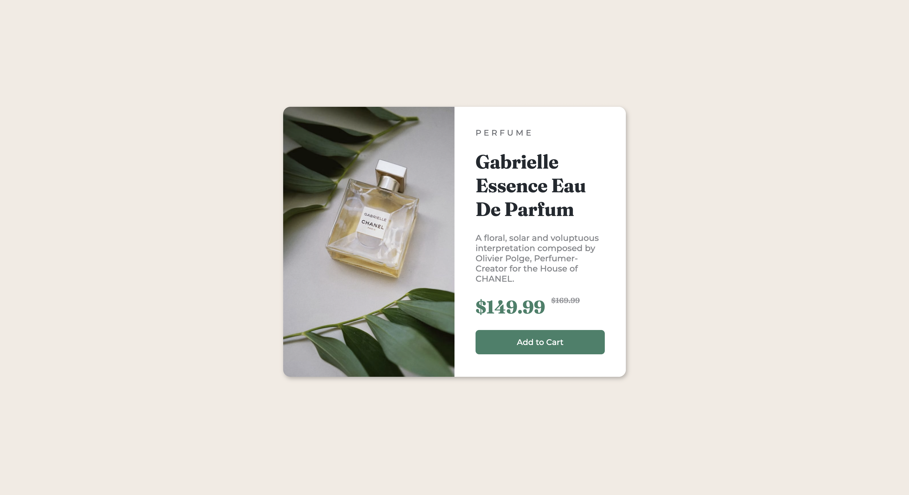

# Frontend Mentor - Product preview card component solution

This is a solution to the [Product preview card component challenge on Frontend Mentor](https://www.frontendmentor.io/challenges/product-preview-card-component-GO7UmttRfa). 

## Table of contents

- [Overview](#overview)
  - [The challenge](#the-challenge)
  - [Screenshots](#screenshots)
  - [Links](#links)
- [My process](#my-process)
  - [Built with](#built-with)
  - [Continued development](#continued-development)
- [Author](#author)

## Overview

### The challenge

Users should be able to:

- View the optimal layout depending on their device's screen size
- See hover and focus states for interactive elements

### Screenshots

Mobile 

Desktop

### Links

- [Solution URL Here](https://github.com/KurtReti/product-preview-card-component-main)
- [Live Site URL Here](https://kurtreti.github.io/product-preview-card-component-main/)

## My process
- Establish the basic layout with html boxes, using borders to see the layout before adding
the text content.
- Moving on to the CSS to add the proper styling, initially I didn't implement any responsive 
design but I added it later to satisfy the challenge properly, implementing some feedback I 
received on my implementation. 

### Built with

- Semantic HTML5 markup
- CSS custom properties
- CSS Breakpoint and Boxes

## Author

- LinkedIn [Kurt Reti](https://www.linkedin.com/in/kurt-reti-aa469924a/)
- GitHub [KurtReti](https://github.com/KurtReti)
- Frontend Mentor [@KurtReti](https://www.frontendmentor.io/profile/KurtReti)
